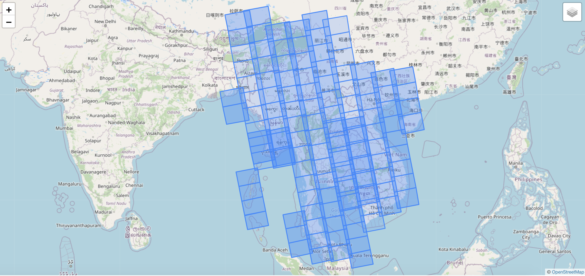

Sentinel 1 pre-processing pipeline using SNAP GPT 7.0

# Getting your setup ready for processing

## 1. [Install gsutil](https://cloud.google.com/storage/docs/gsutil_install)

## 2. Install libraries using `requirements.txt`
   NB: This file is auto-generated using `pip freeze > requirements.txt`

## 3. Construct postgis table using `table.sql`

# Processing

We are using Graph Processor Tool (GPT) to process the sentinel-1 datasets.

## 1. Downloading Image Metadata

We use [Copernicus Open Access Hub](https://scihub.copernicus.eu/) to download the metadata available for the images.
Change your username and password on .env file variable `COPERNICUS_USERNAME` and `COPERNICUS_PASSWORD`

script: `download_image_metadata.py`

## 2. Downloading Image

We use [Alaska Satellite Facility (ASF)](https://asf.alaska.edu/data-sets/sar-data-sets/sentinel-1/) Distributed Data Archive Center (DAAC) to download the sentinel-1 SAR scenes.
This [blog post](https://thegeoict.com/blog/2019/08/19/processing-sentinel-1-sar-images-using-sentinel-application-platform-snap/) has detailed instructions on how you can go about creating an account and downloading via interface the required scene. We modified the python scripts provided by the ASF DAAC to download batch scenes especially utilizing the metadata collected in 1. 

All the images are saved in dir `images`.

script: `download_image.py`

## 3. Preparing Slaves

For co-registration of images, we need slaves images to co-registered against. Update the database with the slaves images where column `slave` is changed to `True`. Use script 1. and 2. to get the metadata and download the slave images.

Example of footprint of set of slaves images we used.

## 4. Processing Slaves

The slaves are processed using `process_slaves.py` and the processed slaved are stored in dir `slaves`. The slaves are processed with step a-f of 5.

## 5. Processing Images

The processing steps with the parameters value are:

a. Apply Orbit File

b. Thermal Noise Removal

    i.  removeThermalNoise: true
    ii. reIntroduceThermalNoise: false

c. Border Noise Removal

    i.  borderLimit: 1000
    ii. trimThreshold: 0.5

d. Calibration

    i.   outputSigmaBand: false
    ii.  outputGammaBand: false
    iii. outputBetaBand: true

e. Multilook

    i.   No. of Range Looks (nRgLooks): 3
    ii.  No. of Azimuth Looks (nAzLooks): 3
    iii. outputIntensity: true
    iv.  grSquarePixel: true

f. Radiometric Terrain Flattening

    i.   demName: SRTM 1Sec HGT
    ii.  demResamplingMethod: BICUBIC_INTERPOLATION
    iii. oversamplingMultiple: 1.5
    iv.  additionalOverlap: 0.1
 
g. DEM Assisted Co-registration

NB: The slaves list are obtained by selecting those images processed in 4. that intersects with the scene currently processed.

    i.   demName: SRTM 1Sec HGT
    ii.  demResamplingMethod: BICUBIC_INTERPOLATION
    iii. resamplingType: BICUBIC_INTERPOLATION
    iv.  tileExtensionPercent: 100
    v.   maskOutAreaWithoutElevation: true

h. Speckle Filtering

    i.   filter: Lee Sigma
    ii.  enl: 4.0
    iii. numLooksStr: 4
    iv.  windowSize: 9x9
    v.   sigmaStr: 0.9
    vi.  targetWindowSizeStr: 5x5

i. Range-Doppler Terrain Correction

    i.   demName: SRTM 1Sec HGT
    ii.  nodataValueAtSea: false
    iii. pixelSpacingInMeter: 10
    iv.  pixelSpacingInDegree: 8.983152841195215E-5

The processed images are then subset to get the master images and exported to individual polarisation bands in the dir `output`

This is accomplished by `process.py` The path to snappy is provided in `.env` as `SNAPPY_PATH`. snappy is used to read the bandnames of the files processed before co-registration, but the actual processing is done via SNAP GPT. 

## 6. Post-processing and pushing to Earth Engine

Specify the Google Cloud Storage path on `GCS_PATH` and the GEE Path on `GEE_ASSET_PATH` env variable.

The post-processing includes using GDAL to scale the output files by factor of 10000 and converting to unsigned integer 16 bit so save storage space in the GEE. The GDAL path is specified with `GDAL_PATH` variable.

The files are then copied to Google Cloud Bucket with gsutil installed and pushed to Earth engine with the manifest upload. The upload includes VV and VH or relevant polarisation of the same scene as different bands with needed metadata obtained in 1. as properties of the image.

# Further tutorial on Processing

#### [Processing Sentinel-1 SAR images using SNAP GUI](https://thegeoict.com/blog/2019/08/19/processing-sentinel-1-sar-images-using-sentinel-application-platform-snap/)

#### [Setting up development environment for SNAP](https://thegeoict.com/blog/2019/08/21/setup-development-environment-for-snap/)

#### [Processing Sentinel-1 SAR images using SNAP Python Interface Snappy](https://thegeoict.com/blog/2019/08/22/processing-sentinel-1-sar-images-using-snappy-snap-python-interface/)

#### [Creating Mosaic of Sentinel-1 using Snappy](https://thegeoict.com/blog/2019/09/03/creating-mosaic-of-sentinel-1-using-snappy/)

#### [Getting started with SNAP GPT](https://thegeoict.com/blog/2019/11/07/ditch-snappy-to-use-graph-processor-tool-gpt-to-process-your-sentinel-1-data/)

#### [Change Detection in Earth Engine using Sentinel-1](https://thegeoict.com/blog/2019/06/17/change-detection-in-google-earth-engine-using-sentinel-1-images/)
 